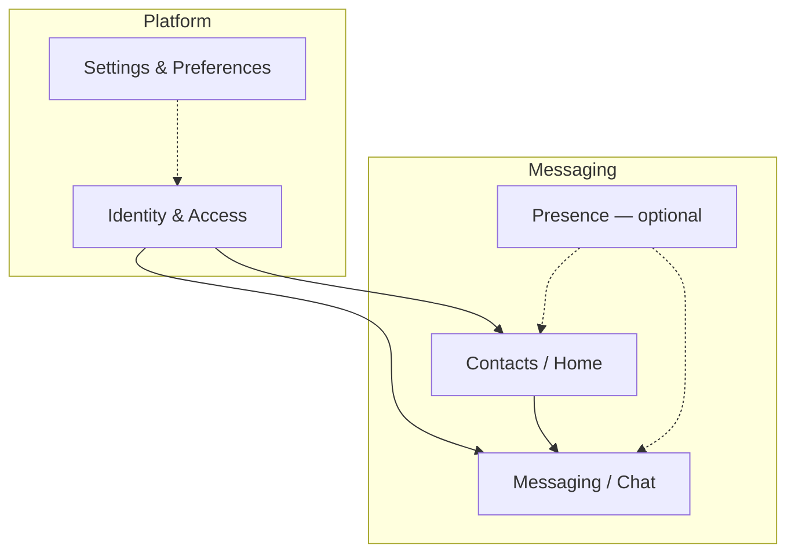

# Bounded contexts (DDD)

Карта предметных областей QuectoChat. Контексты **не обязаны** совпадать 1:1 с feature-пакетами: один context может дать несколько экранов, один feature может оркестрировать несколько репозиториев.

## Диаграмма контекстов

> Пунктиром — контексты, не реализованные в MVP или cross-cutting.

## Контексты

### Identity & Access (IAM)

**Feature:** `features/auth`

**Ответственность:** регистрация, вход, выход, статус сессии.

| Входит | Не входит |
|--------|-----------|
| Login email/password | Список собеседников |
| Registration | Отправка сообщений |
| Logout | Настройки UI |
| Stream `AuthStatus` | |

**Контракты:** `AuthRepository`, порты `AuthenticationStatePort`, `SplashAuthenticationPort`, `AuthSessionPort`.

---

### Contacts / Home

**Feature:** `features/home`

**Ответственность:** список собеседников, поиск, очистка истории чата, переход в переписку.

| Входит | Не входит |
|--------|-----------|
| Список `Interlocutor` | Текст сообщений (это Chat) |
| Поиск по имени | Регистрация пользователя |
| Swipe-to-clear chat | |
| Пагинация списка | |

**Контракт:** `HomeRepository`.

---

### Messaging / Chat

**Feature:** `features/chat`

**Ответственность:** переписка с одним собеседником: чтение, отправка, пагинация, realtime-обновления.

| Входит | Не входит |
|--------|-----------|
| Список сообщений | Auth |
| Отправка текста | Глобальный список контактов |
| Mark as viewed | |
| Realtime stream | |

**Контракты:** `ChatRepository`, доменная модель `Message`.

---

### Presence (опционально)

**Статус:** не реализован в MVP.

**Ответственность:** online/offline статус собеседника, «печатает…».

Может появиться как расширение `HomeRepository` / `ChatRepository` или отдельный thin feature при появлении второго потребителя.

---

### Settings & Preferences

**Статус:** частично в `shared_core` (локаль, тема).

**Ответственность:** язык, тема, локальные настройки приложения.

**План:** выделить в `features/settings` при росте scope.

---

### UI Shell (навигация)

**Пакет:** `navigation`

**Ответственность:** splash, `AppRouter`, guards, маршруты, `AppNavigator`.

**Не bounded context** — application/infrastructure layer для routing.

Компоненты:

- `SplashScreen` + `SplashBloc` — cold start
- `AuthGuard` / `GuestGuard` + `AuthStatusReevaluateListenable` — login vs home
- `AppRouter` — плоский стек: home ↔ chat

## Context map (взаимодействия)

| Upstream | Downstream | Связь |
|----------|------------|-------|
| IAM | Contacts | Только авторизованный пользователь видит home |
| IAM | Chat | userId для Firestore paths |
| Contacts | Chat | `navigateChat(interlocutorId, …)` |
| IAM | UI Shell | `AuthStatus` → guards reevaluate |
| Home | IAM | Logout через `AuthSessionPort` |

Cross-feature wiring — только `lib/di/auth_port_adapters.dart` и `AppNavigator`.

## Ubiquitous language (глоссарий)

| Термин | Значение |
|--------|----------|
| User | Текущий авторизованный пользователь Firebase Auth |
| Interlocutor | Собеседник в списке чатов |
| Message | Единица переписки |
| Chat | Диалог между двумя пользователями (не feature-пакет, а предметная область) |
| AuthGuard / GuestGuard | Охрана маршрутов по `AuthStatus` |
| AppRouter | Плоский стек маршрутов (auto_route) |
