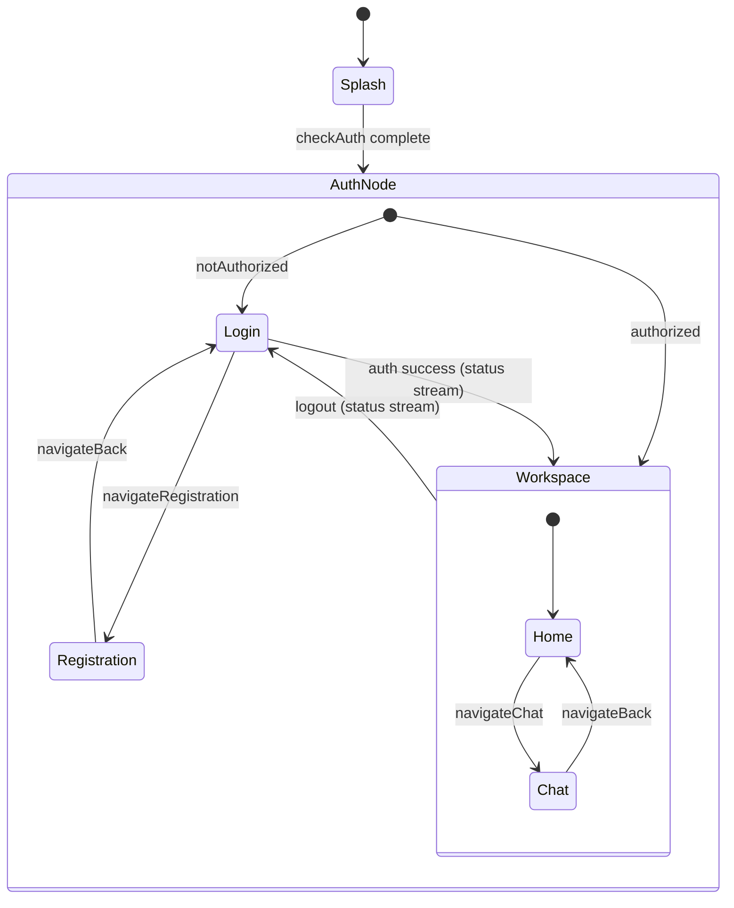

# Навигация и пользовательские потоки

QuectoChat использует **ручные Map-маршруты** (`RootRoutes`, `NestedRoutes`) и порт `AppNavigator` — см. [adr/adr-013-manual-routes.md](adr/adr-013-manual-routes.md).

## Точки входа

| Entry | Маршрут | Когда |
|-------|---------|-------|
| Cold start | `RootRoutes.routeSplash` (`/`) | Всегда (`MaterialApp.initialRoute`) |
| Logout | Auth status → `AuthNode` показывает `LoginScreen` | Явный выход из home |

## Два уровня Navigator

```
MaterialApp (root navigatorKey)
├── /                    SplashScreen
├── routeAuthController/ AuthNode  → LoginScreen | Workspace
├── routeLogin/          LoginScreen (push с login)
└── routeRegistration/   RegistrationScreen (push с login)

Workspace (nestedNavigatorKey)
├── routeHome/           HomeScreen
└── routeChat/           ChatScreen (+ arguments)
```

Root-стек управляет auth-flow; nested-стек — рабочая зона после входа.

## Граф маршрутов



## Splash

1. `SplashBloc` вызывает `SplashAuthenticationPort.checkAuth()`.
2. После инициализации — `SplashEffect.navigateAuthNode` → `AppNavigator.navigateAuthNode()`.
3. `AuthNode` по `AuthStatus` показывает `LoginScreen` или `Workspace`.

Файлы: `navigation/lib/src/presentation/splash_screen/`.

## AuthNode

- `AuthBloc` подписан на `AuthenticationStatePort.authStatusStream`.
- При смене статуса — `AuthEffect.popToRoot` → `AppNavigator.popToRoot()` (сброс login/registration с root-стека).
- UI: `authorized` → `Workspace`, `notAuthorized` → `LoginScreen`.

## Login

1. Пользователь вводит email + password.
2. `AuthRepository.logIn` → `Outcome<void, LoginFailure>`.
3. При успехе статус меняется через Firebase Auth stream; `AuthNode` переключает UI на workspace.
4. Эффект `LoginEffect.navigateRegistration` → `AppNavigator.navigateRegistration()`.

## Registration

1. FAB «назад» → `AppNavigator.navigateBack()` (pop registration).
2. Submit → `AuthRepository.registration(...)`.
3. При успехе — auth stream → workspace (как после login).

## Home → Chat

1. Tap по плитке собеседника → `AppNavigator.navigateChat(interlocutorId, firstName, lastName)`.
2. Nested push `NestedRoutes.routeChat` с record-arguments.
3. `ChatScreen` читает arguments из `ModalRoute.settings`.

## Chat → Home

1. Кнопка «назад» в app bar → `AppNavigator.navigateBack()` (nested pop).
2. `Workspace` + `PopScope`: если nested может pop — pop; иначе `SystemNavigator.pop()` (выход из приложения).

## AppNavigator (navigation_api)

| Метод | Назначение |
|-------|------------|
| `navigateSplash()` | Reset root на splash |
| `navigateAuthNode()` | Replace root на AuthNode |
| `navigateLogin()` | Push login на root |
| `navigateRegistration()` | Push registration на root |
| `navigateBack([result])` | Pop nested, иначе pop root |
| `popToRoot()` | Pop root до первого маршрута |
| `navigateChat(...)` | Push chat во nested navigator |

Реализация: `navigation/lib/src/app_navigator/app_navigator_impl.dart`.

## Правила для разработчика

- Features и `shared_ui` **не** вызывают `Navigator` напрямую.
- BLoC эмитит `Effect`; screen/listener вызывает `AppNavigator`.
- Простые UI-действия (back button) — коллбэк `onPressed` → `AppNavigator` в Content/Screen.
- Новый маршрут: константа в `RootRoutes` или `NestedRoutes`, builder в Map, метод в `AppNavigator`.

## Deep links (будущее)

| Path | Назначение |
|------|------------|
| `/chat/:userId` | Открыть переписку |
| `/login` | Экран входа |

Формат согласовать при добавлении `onGenerateInitialRoutes` / uni_links.
