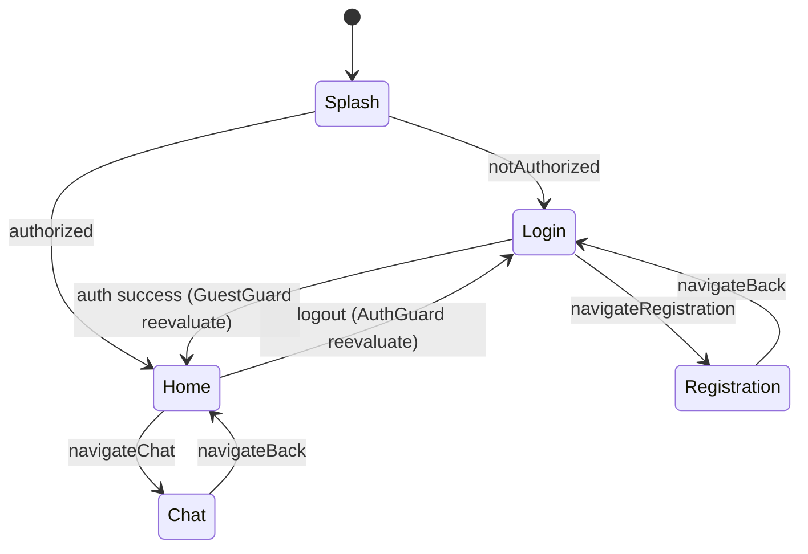

# Навигация и пользовательские потоки

QuectoChat использует **auto_route** (`AppRouter`) и порт `AppNavigator` — см. [adr/adr-016-auto-route.md](adr/adr-016-auto-route.md).

## Точки входа

| Entry | Маршрут | Когда |
|-------|---------|-------|
| Cold start | `SplashRoute` (initial) | Всегда |
| Logout | `AuthGuard` / `GuestGuard` + `reevaluateListenable` | Явный выход из home |

## Плоский стек AppRouter

```
MaterialApp.router (AppRouter)
├── SplashRoute          SplashScreen (initial)
├── LoginRoute           LoginScreen (+ GuestGuard)
├── RegistrationRoute    RegistrationScreen (+ GuestGuard)
├── HomeRoute            HomeScreen (+ AuthGuard)
└── ChatRoute            ChatScreen (+ AuthGuard, typed args)
```

## Граф маршрутов



## Splash

1. `SplashBloc` вызывает `SplashAuthenticationPort.checkAuth()`.
2. Эффект: `navigateLogin` или `navigateHome` через `AppNavigator`.

Файлы: `navigation/lib/src/presentation/splash_screen/`.

## Guards

- `AuthGuard` — неавторизованных на `LoginRoute`.
- `GuestGuard` — авторизованных с login/registration на `HomeRoute`.
- `AuthStatusReevaluateListenable` подписан на `AuthenticationStatePort.authStatusStream` и передаётся в `appRouter.config(reevaluateListenable:)`.

## Login

1. Email + password → `AuthRepository.logIn` → `Outcome`.
2. Успех меняет `authStatus` → reevaluate → `GuestGuard` → Home.
3. `LoginEffect.navigateRegistration` → `AppNavigator.navigateRegistration()`.

## Registration

1. FAB «назад» → `AppNavigator.navigateBack()`.
2. Submit → `AuthRepository.registration(...)`.
3. Успех → reevaluate → Home.

## Home → Chat

1. Tap по плитке → `AppNavigator.navigateChat(interlocutorId, firstName, lastName)`.
2. `ChatRoute` с типизированными аргументами → `ChatScreen(...)`.

## Chat → Home

1. Кнопка «назад» → `AppNavigator.navigateBack()`.

## AppNavigator (navigation_api)

| Метод | Назначение |
|-------|------------|
| `navigateLogin()` | `replaceAll([LoginRoute])` |
| `navigateRegistration()` | `push(RegistrationRoute)` |
| `navigateHome()` | `replaceAll([HomeRoute])` |
| `navigateBack([result])` | `maybePop` |
| `navigateChat(...)` | `push(ChatRoute(...))` |

Реализация: `AppRouter implements AppNavigator` в `navigation/lib/src/app_router/app_router.dart`.

## Deep links

Пока не реализованы. `ChatRoute` уже типизирован — deep link `/chat/:interlocutorId` можно добавить позже.
